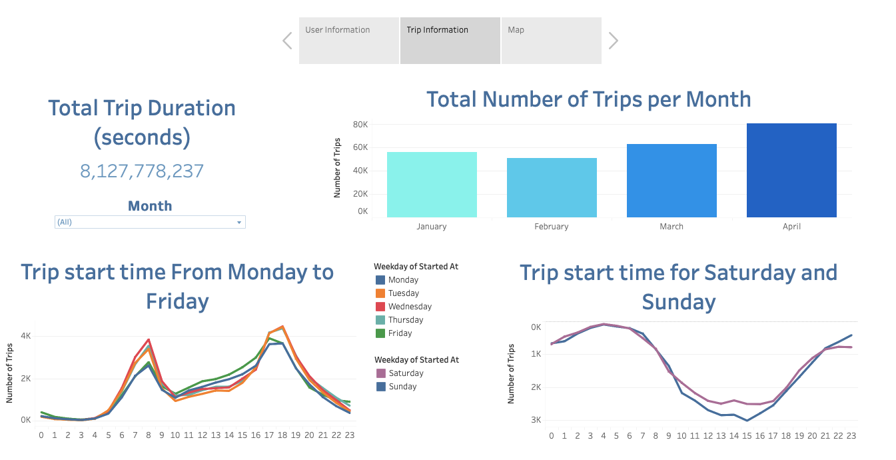

# citibike
Challenge 18

 - [Click here to visit Tableau dashboard](https://public.tableau.com/app/profile/violetta.antonova/viz/CitiBike_16862592387140/CitiBike)
 - [Project file](CitiBike.twbx)

# Data Cleaning
For this challenge I used [Citi Bike Data](https://citibikenyc.com/system-data). As all the data sets were seperated by months, each month different csv file. I've used data from January to April of 2023 year.  I've decided to use Python to combine all the files to one csv file for future use in Tableau dashboard creation. My Jupiter notebook with code could be find [here](Resources/preparing_data.ipynb).

Files that were used:
  - [Combined csv](Resources/combined_df.csv)
  - [csv by month](Resources/Files)

# Dashboard
Data that was prepared with Python was used to create dashboard and to make analysis.

## User Information
 - During 4 months in year 2023 were taken 251,048 trips.
 - 76.66% of users are members - than means than mostly Citi Bike users are permanent. While only 23.34% users don't have membership.
 - 77.59% of all trips were taken with classic bikes, 22.06% of trips been taken with electric bike and only 0.35% of trips docked bike.
Basic on the informatin provided I could say that in fisrt 4 months of year 2023 the average user of the Citi Bike is Member that preferes rides with classic bike.
Also you can visit my dasboard that is given on top of the page and you could change the dasboard accordingly to Bike type, Membership type and see changes Monthly.

## Trip Information
  - Total trip duration in first 4 months of 2023 is 8,127,778,237 seconds, that is equal to 257.7 years.
  - From the bar chart we can see that most trips were taken in April. As I could state is easily predictable that in worm months people more often choose to walk and cycle.
  - From line chars on left we could see that from Monday to Friday there are two peak times ar 8 am and 17-18 pm, tris represent that customers are more likely to ride to and from work. 
  - From line chart on right side representing trips in Saturday and Sunday we could see that customers prefer ridind at early morning and late night and there is drop in trips number by the midday.
Accordingly information above I could say that as warmes is weather outside as more people are choosing Citi bike services to get to anf from work.
Also you can visit my dasboard that is given on top of the page and you could change the dasboard accordingly to Months.

## Trip Information
  - On this dasboard you could see Top 10 start and end stations and 9 out of 10 are most used as biginning and ending stops.
  - Also there are represented Start and End stations maps. Mostly trips start point is from Jersey city, top 3 start points are Grove St PATH, Hoboken Terminal and South Waterfront Walk. Same 3 stations are most used as end stations. But there are some spread in end points, some trips end in New York and Newark.
  - Also you can visit my dasboard that is given on top of the page and you could change the dasboard accordingly to Years and Months.

# Conclusion
In conclusion, my analysis represents an overview of trends and patterns for Citi Bike users for a specific time period. With created interactive dashoards and visualisations were highlighted trends in user type, foud trip patterns and extracted insights. 
